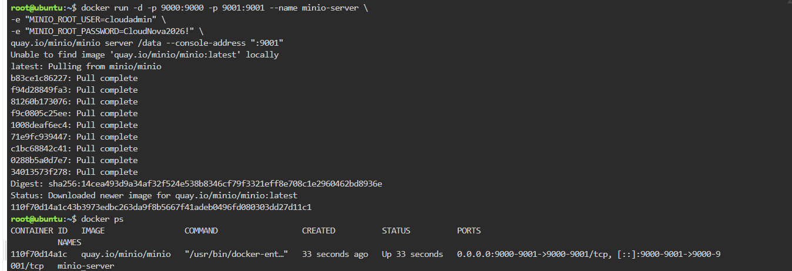
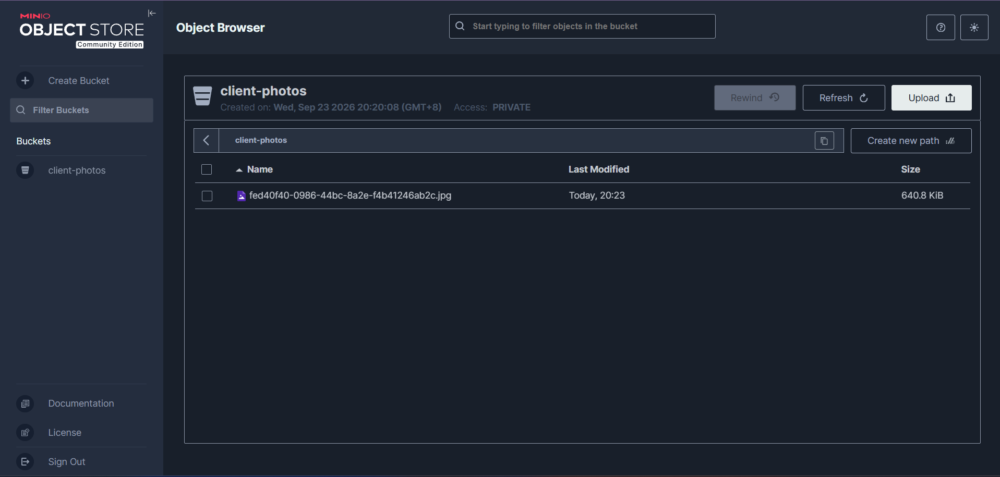

# MinIO Deployment

## Overview

For this mission, I deployed MinIO as an S3-compatible Object Storage server using Docker. MinIO provides a web-based console where I can manage buckets and uploaded objects.

## Docker Command

The following Docker command was used to download and start the MinIO server:

```bash
docker run -d -p 9000:9000 -p 9001:9001 --name minio-server \
-e "MINIO_ROOT_USER=cloudadmin" \
-e "MINIO_ROOT_PASSWORD=CloudNova2026!" \
minio/minio server /data --console-address ":9001"
```

## Docker Command Explanation

* `docker run` – Creates and starts a new Docker container.
* `-d` – Runs the container in detached mode, allowing it to run in the background.
* `-p 9000:9000` – Maps port 9000 of the container to port 9000 of the host for the MinIO API.
* `-p 9001:9001` – Maps port 9001 of the container to port 9001 of the host for the MinIO Web Console.
* `--name minio-server` – Gives the container the name `minio-server`.
* `-e` – Sets environment variables inside the container.
* `minio/minio` – Specifies the MinIO Docker image.
* `server /data` – Starts MinIO and uses `/data` as the storage location.
* `--console-address ":9001"` – Configures the MinIO Web Console to use port 9001.

## Environment Variables

The `-e` flags were used to set the login credentials for the MinIO server.

```text
MINIO_ROOT_USER=cloudadmin
MINIO_ROOT_PASSWORD=CloudNova2026!
```

The `MINIO_ROOT_USER` variable sets the administrator username, while `MINIO_ROOT_PASSWORD` sets the administrator password.

## Web Console Port

The MinIO Web Console was accessed using:

```text
Port 9001
```

Port 9001 was entered in the KillerCoda Traffic / Ports or Custom Ports section to open the MinIO Web Console.

## MinIO Login Credentials

```text
Username: cloudadmin
Password: CloudNova2026!
```

## Bucket Created

The storage bucket created for the client was:

```text
client-photos
```

The `client-photos` bucket was used to store the sample image or file uploaded during the activity.

## Verification

The MinIO container was checked to make sure that it was running successfully.

The MinIO Web Console was then accessed through port 9001. After logging in, the `client-photos` bucket was created and a sample file was uploaded successfully.

## Screenshots

### MinIO Deployment



### Bucket and Uploaded File



